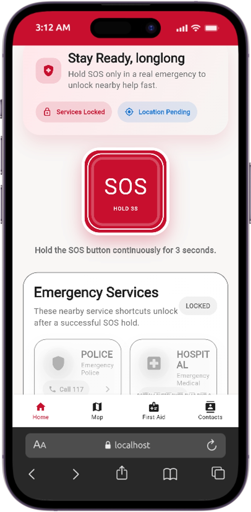

# KhmerSOS Emergency Assistance App

KhmerSOS is a Flutter-based emergency assistance application designed to help users respond faster during urgent situations. The app combines SOS activation, nearby emergency service discovery, first-aid guidance, live map support, and personal emergency contact management in a single mobile experience.

This frontend is paired with a NestJS backend that provides authentication, emergency service data, SOS logging, user profile management, and first-aid content APIs.

## Repository Links

- Frontend repository: <https://github.com/oulongheng09/Emergency_App>
- Backend repository: <https://github.com/oulongheng09/Emergency_Backend>
- GitHub organization page: <https://github.com/orgs/oulongheng09/repositories>

## Project Overview

The goal of this project is to provide a practical emergency support application for users in Cambodia. The system focuses on:

- Fast SOS activation
- Access to nearby hospitals, police stations, ambulances, and fire services
- First-aid learning and quick reference
- Emergency contact management
- Bilingual user experience in English and Khmer

## Key Features

- User authentication with login and registration
- SOS button with location-based emergency logging
- Nearby emergency services by category: police, hospital, ambulance, and fire department
- Live map view with current location tracking
- Route guidance to emergency destinations
- Quick-call shortcuts for emergency numbers
- First-aid category listing from backend data
- Embedded first-aid training videos for CPR, burns, bleeding, choking, and snake bite response
- Personal emergency contact management for adding, editing, and deleting contacts
- User profile integration
- English and Khmer localization
- Light and dark theme support
- Responsive Flutter UI for multiple screen sizes

## Screenshots

### Application Preview

<p align="center">
  
</p>

## Technology Stack

### Frontend

- Flutter
- Dart
- `flutter_map`
- `geolocator`
- `http`
- `url_launcher`
- `video_player`

### Backend

- NestJS
- TypeScript
- Supabase Authentication
- TypeORM
- PostgreSQL
- Swagger API documentation

## System Architecture

The project is split into two main parts:

1. `emergency_front_end`
   Flutter mobile/web client for the user interface and user interactions.
2. `emergency_backend`
   NestJS REST API for authentication, user data, emergency services, SOS logs, and first-aid resources.

The frontend communicates with the backend through HTTP requests. User authentication is handled through Supabase on the backend side, while the frontend consumes the resulting session and user data.

## Folder Structure

### Frontend

```text
emergency_front_end/
├── android/                Android platform files
├── assets/                 App assets such as videos, mock data, icons, and images
├── ios/                    iOS platform files
├── lib/
│   ├── core/               Constants, services, and utilities
│   ├── data/               Local/mock data sources
│   ├── features/           Feature screens such as auth, home, map, and first aid
│   ├── l10n/               Localization helpers
│   ├── models/             Data models
│   ├── router/             Routing-related code
│   ├── state/              App-level state management
│   ├── theme/              Colors, typography, and app themes
│   ├── widgets/            Reusable UI widgets
│   ├── app.dart            Root app widget
│   └── main.dart           Application entry point
├── linux/                  Linux platform files
├── macos/                  macOS platform files
├── test/                   Widget tests
├── web/                    Web platform files
├── windows/                Windows platform files
├── flutter_01.png          Project screenshot
└── pubspec.yaml            Flutter dependencies and assets
```

### Backend

```text
emergency_backend/
├── src/
│   ├── auth/                       Authentication module
│   ├── emergency-services/         Nearby emergency service APIs
│   ├── first-aid-categories/       First-aid category APIs
│   ├── first-aid-tips/             First-aid tip APIs
│   ├── service-types/              Service type APIs
│   ├── sos-logs/                   SOS logging APIs
│   ├── user-emergency-contacts/    Emergency contact APIs
│   ├── users/                      User profile APIs
│   └── main.ts                     Backend bootstrap file
├── test/                           End-to-end tests
├── API_DOCUMENTATION.md            Manual API reference
└── package.json                    Backend dependencies and scripts
```

## Prerequisites

Make sure the following tools are installed before running the project:

- Flutter SDK
- Dart SDK
- Node.js
- npm
- A running PostgreSQL database for the backend
- Supabase project credentials for authentication

## How to Run the Project

### 1. Run the Backend

From the project root, open a terminal in the backend folder:

```bash
cd emergency_backend
npm install
```

Create or update the backend `.env` file so the server runs on port `3001`, which matches the frontend default API configuration:

```env
PORT=3001
```

Then start the backend:

```bash
npm run start:dev
```

Backend URLs:

- API base URL: `http://localhost:3001`
- Swagger documentation: `http://localhost:3001/api`

### 2. Run the Frontend

From the project root, open a terminal in the frontend folder:

```bash
cd emergency_front_end
flutter pub get
```

Run the application:

```bash
flutter run
```

If you want to explicitly point the frontend to a backend URL, run:

```bash
flutter run --dart-define=API_BASE_URL=http://localhost:3001
```

For Android emulator use:

```bash
flutter run --dart-define=API_BASE_URL=http://10.0.2.2:3001
```

## Useful Commands

### Frontend

```bash
flutter pub get
flutter analyze
flutter test
flutter run
```

### Backend

```bash
npm install
npm run start:dev
npm run build
npm run test
npm run test:e2e
```

## API Modules Used by the Frontend

The frontend integrates with the following backend modules:

- `auth`
- `users`
- `user-emergency-contacts`
- `sos-logs`
- `emergency-services`
- `first-aid-categories`
- `first-aid-tips`

## Notable Implementation Details

- The frontend automatically uses `http://localhost:3001` by default.
- On Android emulator, the frontend uses `http://10.0.2.2:3001`.
- SOS logging requests nearby emergency services before creating an SOS log.
- The map screen uses live device location and route rendering for navigation support.
- The app supports both English and Khmer for accessibility and local relevance.

## Academic Summary

This project demonstrates full-stack mobile application development using Flutter and NestJS. It includes user authentication, API integration, geolocation, responsive UI design, emergency workflow handling, media integration, and structured modular architecture. The system is suitable as a practical academic project because it combines real-world usability with modern software engineering practices.

## License

This project is intended for academic and educational purposes only.
